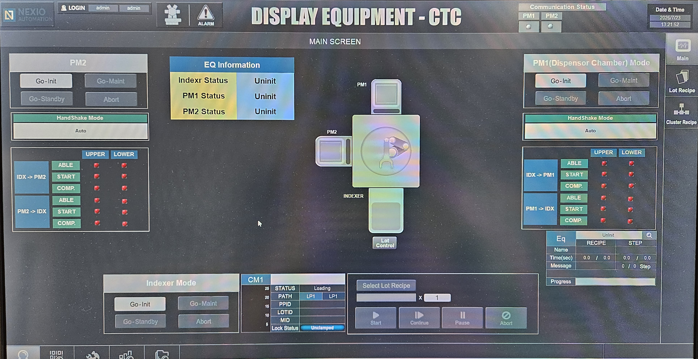
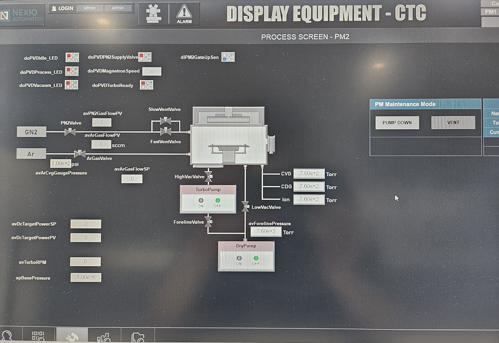
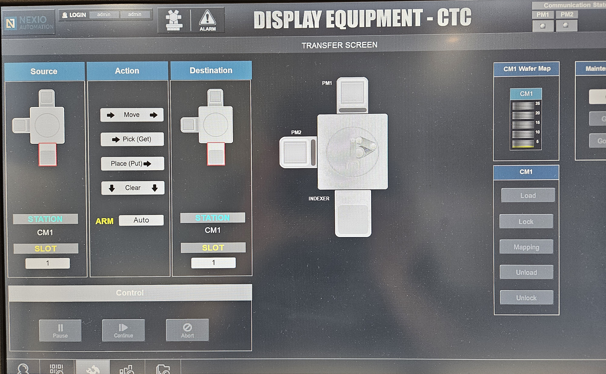

## GUI
### 1. 메인 화면

- 주요 기능
  - Go-Init : 설비를 초기 상태로 설정합니다.
  - Go-Maint : Manual 동작을 수행하도록 상태를 변경합니다.
  - Go-Standby : Auto Run 동작을 수행하도록 상태를 변경합니다.
  - Abort : 설비의 동작을 중단시킵니다.
  - HandShake 상태를 나타냅니다.
- AutoRun 실행
  - Lot Control 또는 Select Lot Recipe를 클릭
  - 레시피를 선택하고 실행합니다.

### 2. PM1 Manual 동작

- Motion Option : 노즐을 해당 위치로 이동시킵니다.  
- SHUTTLE : 노즐이 왕복으로 이동합니다.
- ONEWAY : 노즐이 편도로 이동합니다.
- FLOW : 노즐의 LED를 켜거나 끕니다.

### 3. PM2 Manual 동작

- Sputter 챔버의 Digital I/O를 끄거나 켤 수 있습니다.
- 설비의 Manual 동작을 키트에서 LED On/Off를 통해 표현하였습니다.

### 4. PM2 Function

- PUMP DOWN : 챔버 내부를 진공으로 만드는 동작을 수행합니다.
- VENT : 질소 가스를 주입해 챔버 내부를 대기압 상태로 만듭니다.

### 5. Transfer Function

- MOVE : Source의 위치에서 자재를 pdick한 후 Destination 위치에 place를 수행합니다.
- PICK : 로봇이 Down -> Extend -> Up -> Retract 동작을 실행해 자재를 가져갑니다.
- PLACE : 로봇이 Up -> Extend -> Down -> Retract 동작을 실행해 자제를 모듈에 적재합니다.

### 6. PM1 ProcessRCP

- Developer(PM1)에서의 프로세스 레시피 변수의 값을 설정할 수 있습니다. 

### 7. PM2 ProcessRCP

- Sputter(PM2)에서의 프로세스 레시피 변수의 값을 설정할 수 있습니다. 

### 8. Parameter I/O 값

- Parameter I/O 값을 설정합니다.
- 설비 Real I/O의 값을 미리 설정한 파라미터 값으로 초기화합니다.