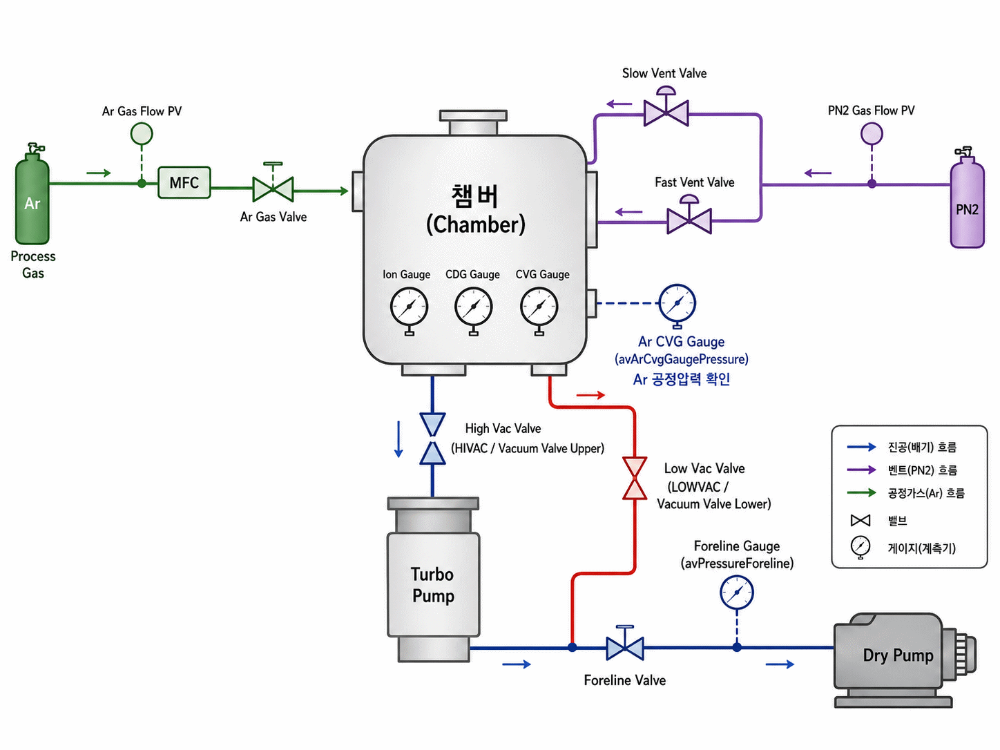

# pvd-sputter-control-project
[Date : 2026-06-29 ~ 2026-07-24]  
Display Equipment Control Software Training by Display Academy  
  
### 1. 프로젝트 개요
[Date: 2026-07-20 ~ 2026-07-24]  
EasyCluster Framework를 이용해 PVD sputtering 공정의 설비 제어 S/W를 구현하였습니다.  

#### 1.1. 공정 개요
- PVD 공정이란
  - '물리적 기상 증착'이라고 불리는 공정으로 디스플레이에서 TFT를 만들 때 금속층을 형성하기 위한 방법 중 하나입니다.
  - 배선의 재료인 금속성 물질을 TFT 기판 위에 도포해 얇은 막을 형성하는 공정입니다. 
- 스퍼터(Sputter)
  - 수십~ 수백 eV 이온이 결합 에너지를 초과해 원자를 방출하게 되고, 표면 원자가 튀어나오는 것을 sputtering이라고 합니다.
  - 공정 순서
    1) 진공 형성
       - 10^(-6)Torr 이하까지 배기를 진행합니다.
    2) 아르곤(Ar) 주입
    3) 방전 방식 선택
       - 금속 타깃의 경우 DC방전(도전성 우수, 안정적) -> 본 프로젝트에서 사용하였습니다.
       - 절연체나 산화물 타깃의 경우에는 RF방전(전하 축적 방지 필요)을 사용합니다.  
    4) 프리 스퍼터링 (본 프로젝트에서는 구현하지 않았습니다.)
    5) 타깃 스퍼터링
       - 아르곤 이온이 타깃 쪽으로 가속되어 충돌합니다. 
       - 이온이 가진 에너지가 타깃 원자의 결합 에너지보다 크면 타깃 표면에서 원자가 튕겨져 방출되게 됩니다.
    6) 대기압 복귀(Vent) 동작 실행

#### 1.2. 주요 구현
- **[GUI](#2-gui)**
  - EasyCluster에서 제공하는 GUI Editor를 이용하였습니다.
- **[I/O Define](#3-io-define)**
  - 제어 SW 구현 키트의 물리적인 한계로 설비의 IO는 LED의 On/Off 형태로 연결해 사용하였습니다.
  - **Real I/O**, **Virtual I/O**, **Parameter I/O**로 구분할 수 있습니다.
- **[Interlock/Alarm](#4-interlockalarm)**
  - 상호간 동작에 대한 보완 장치입니다.
- **[Function](#5-function)**
  - **Transfer Module** : Robot이 Glass를 PM1과 PM2에 전송하는 동작을 구현하였습니다.
  - **PM1**(Developer) : Nozzle의 이동, On/Off 동작을 구현하였습니다.
  - **PM2**(Sputter) : Sputter 공정에서의 Pump Down, Vent 동작을 구현하였습니다.
- **[HandShake](#7-handshake)**
  - Transfer Module과 PM간의 Glass 이동 시의 통신 규약입니다.
- **[Recipe](#8-recipe)**
  - **Lot Recipe** : Glass 각 장마다 적용될 Cluster Recipe를 선택합니다.
  - **Cluster Recipe** : 한 장에 대한 Glass의 Path를 설정합니다.
  - **Process Recipe** : Chamber에서 Glass에 적용될 공정 Recipe입니다.

#### 1.3. 설비 구성도

- 프로젝트 진행 중 강사님께 제공받은 이미지 입니다.

### 2. GUI
EasyCluster에서 제공하는 GUI Editor를 이용하여 UI 화면을 편집하였습니다.(Visual Studio와 유사)  
[세부적인 UI 화면으로 이동(클릭)](GUI/README.md)

### 3. IO Define
iodefine.io -> IO/Module/PM*.cfg 또는 IO/Module/PM*.con 파일로 I/O 값을 설정합니다.
- 크게 Input/Output으로 구분되며 In은 센서의 값을 읽고 Out은 값을 출력합니다.
- digital, Analog, string : digital 값은 정수값, Analog는 실수값, string은 문자열을 의미합니다.
- Real I/O : 실제 장비와 연결된 IO
- Virtual I/O : 실제 장비와 연결되어 있지 않은 IO
  - 프로그램의 변수와 유사하게 사용합니다.
  - 일반적으로 장비 매개 변수를 사용하여 I/O 상태 또는 program signal 계산에 사용됩니다.
- Parameter I/O : 프로그램 변수와 유사하게 사용하지만, IO의 Data가 소모성이 아닌 File 형태로 저장되어 사용됩니다.

### 4. Interlock/Alarm
- 상호간 동작에 대한 보완 장치 입니다.
- 공정전, 중, 후 및 다양한 상황에 기계에서 원치 않은 상태를 예방하기 위해 사용합니다.
- 인터락의 종류는 SW, HW, Safety Interlock이 있습니다.
- **Setpoint Interlock** : Action을 하려고 할 때 Status값이 만족 하지 못하면 Action을 차단합니다.
- **Value Interlock** : Status 값이 기준값 이상일 경우 Action을 진행한다.

### 5. Function
Main Engine과 연결되어지는 단일 실행 Code입니다.
#### 5.1. Functions 간의 정보 전달
- Function은 각각의 Level을 가지고 High Level Function이 Low Level Function에게 Message를 하달하는 구조입니다.
- 사용자 인터페이스인 GUI Function에서 최상위 Level Function인 **SCHEDULER**를 통해 각 FUNCTION을 제어합니다.
#### 5.2. 독립된 실행 파일 형태
- Function 하나하나가 실행 파일(exe) 형태로 구성되어집니다.
- 반드시 Main Engine과 Process 통신을 통해 동작합니다.
- 실제 장비 IO, Alarm 등 실제 제어는 Main Engine에서 담당합니다.
- IO Define 과정 등을 통해 각 Function과 Main Engine을 연결합니다.
#### [5.3. Function 구현 사항으로 이동(클릭)](Function)

### 7. HandShake
- 이송 중 파손 방지를 위해 Handshake Signal을 사용합니다.
- 정확한 신호 순서가 중요합니다.
- 장비 간 동기화 신호입니다.
  1) Send Able : 보내는 쪽 준비 완료
  2) Recv Able : 받는 쪽 준비 완료
  3) Send Start : 보내는 작업 시작
  4) Recv Start : 받는 작업 시작
  5) Send Complete : 전송 완료
  6) Recv Complete : 수신 완료
- 자재를 받을때는 Lower, 자재를 전달할 때는 Upper로 나타냅니다.

### 8. Recipe
#### 8.1. Recipe 종류
- **Lot Recipe**: Wafer의 **각 장마다 적용될 Cluster Recipe를 선택합니다.**
	- Cluster Recipe를 몇 번째 슬롯에서 돌릴 것인지에 대한 Recipe 작성합니다.
	- Lot Recipe는 **Auto Run 동작 시 발생되는 Recipe 항목입니다.**
	- 이전 Recipe 작성과 동일한 기능을 제공합니다.. (생성, 수정, 삭제)
- **Cluster Recipe**: 1장에 대한 Wafer의 PM Path를 작성합니다.
	- Process Recipe를 **Depth를 통해 어떻게, 어느 시점에 Process를 돌릴 건지에 대한 Recipe입니다.**
	- Pre / Post Recipe는 Wafer가 Chamber가 공급되기 전, 회수 후에 발생되는 Recipe입니다.
	- Main Recipe는 Wafer가 Chamber 안에 공급되고나서 발생되는 Recipe입니다.
- **Process Recipe**: Wafer에 적용될 공정 Recipe입니다.
	- 전공정 증착 혹은 식각되는 막의 종류나 그 형태, 속도 등을 결정하는 공정 조건입니다.
	- 설비 종류, 공정 조건 및 제어 형태에 따라 Recipe Step 및 항목이 다양하게 작성됩니다.

#### 8.2. Recipe 구현사항
[Recipe 영상](https://drive.google.com/file/d/1A8q7_5iIirdDRSfzdSXk4s9obNzH409t/view?usp=drive_link)
- Recipe를 GUI에서 등록 및 설정하는 영상입니다.

#### 8.3. Recipe 동작
1) CM!에서 Cluster Recipe로 설정된 경로로 Move 동작을 수행합니다.
2) Process Recipe를 수행합니다.
3) 공정 완료 후 Cluster Recipe에 설정된 다음 경로로 Move 합니다. 완료 후 다시 2)를 수행합니다.  
   (다음 경로가 없을 경우 설정한 도착지점으로 Move하고 Auto Run을 완료합니다..) 

#### 8.4. Process Recipe 구현
(F_SEQ.dat)SCHEDULER_PROCESS_PM00 -> "Sequence/Interface_Run_Recipe.cfg|PM00" 수행합니다.  
-> PM00.PROCESS_IN  
-> Sequence/SeqProcessPM00/Sequence.exe 실행 (PM00 메세지 전달)  
-> Program_Main()이 실행됩니다.  
-> Program_Main_Sub()이 실행됩니다. (공정 전, 실행, 후 동작 수행)    
-> **Recipe_Reading(&nAppendData)** 를 통해 레시피 변수를 읽습니다.  
-> Pre_Process() 공정 전 동작을 실행합니다. (ex Pump Down 등)  
-> **Process_Main()** : Main 공정 프로세스를 진행합니다.    
  하위 레벨의 Function에 메시지를 보내서 수행하는 것이 이상적이지만 프로젝트 시간 부족 문제로 SEQ_SPUTTER_DEVICE_CONTROL이라는 강사님께서 미리 만들은 EXE파일에 메시지를 보내는 방식으로 바로 구현하였습니다.   
-> Post_Process() : 공정 후 수행할 동작을 진행합니다. (ex Vent 등)  

### 9. 설비 AutoRun 동작
[설비 AutoRun 영상](https://drive.google.com/file/d/1Ue6DWdgKNxRe6FYfPdrqr5W0nmlNf8Dg/view?usp=drive_link)

### 9. EasyCluster 설치 및 프로그램 실행 방법
1) EasyCluster(2019.10.31)_V3.8 -> Setup.exe 설치
2) K 드라이브 생성확인 및 SystemConsole 생성여부 확인
3) Run.bat 또는 Simulation.bat 실행

### 10. 사용 스택, 기술
1) Framework : EasyCluster v3.8 Engine
2) Language : C
3) IDLE : Visual Studio(2022)
